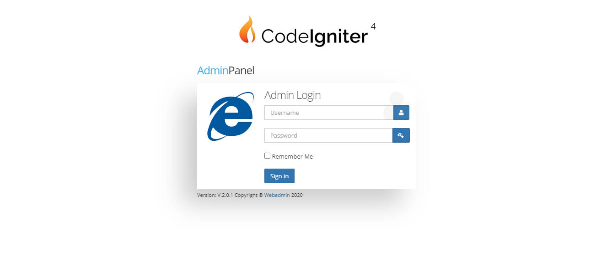

# Codeigniter4-Admin-with-CRUD

Included Features

1) A Sample Admin Panel Login and Authorisation
2) CMS Section For Explaining all CRUd Functionalities
3) You Can add, Edit, delete, Change Status, Upload Image.etc.. all Functions Added
4) Db file is placed in db folder in root

Please Note, thios ia a sample project done for displaying the CRUD operations

